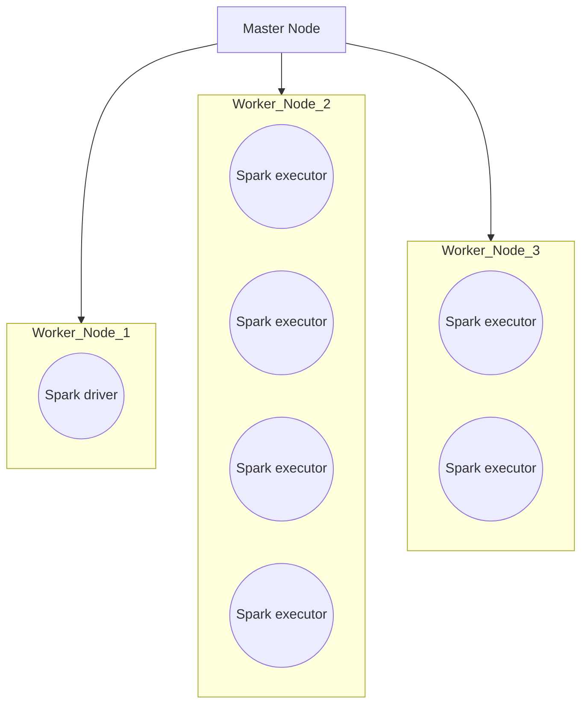
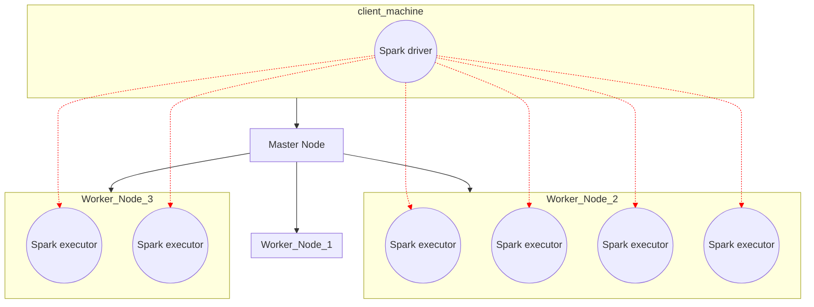

# Deploying Spark Applications on a Cluster

---

## The Anatomy of a Cluster

- Spark cluster manager
  - one node manages the state of the cluster
  - the others do the work
  - communicate via driver/worker processes
- Cluster Managers: Standalone, YARN, Mesos
- Spark Driver
  - Manages the state of the stages/tasks of the application
  - Interfaces with the cluster manager
- Spark executors
  - Run the tasks assigned by the Spark driver
  - Report their state and results to the driver
- Execution mode
  - Cluster
  - Client
  - Local

---

Cluster mode 
- 
- the Spark driver is launched on a worker node
- the cluster manager is responsible for Spark processes
- All communication between the spark driver and the spark executors will be done inside the cluster

---

Client Mode
-
- the Spark driver is on the client machine
- the client is responsible for the Spark processes and state management

---
# Local Mode

- The entire application runs on the same machine --- as much paralellism as many cores as you have on your CPU

---

# Summary / Key points for elaboration
- Spark cluster manager
  - Driver node + worker nodes
  - standalone, YARN, Mesos
- Spark processes
  - driver 
  - executor
- Deploy modes
  - cluster: driver + executors launched on cluster
  - client: driver launched on client, executors on cluster
  - local: everything on the same machine
- Deploy a Spark app
  - package a JAR
  - ship the JAR + data on the cluster
  - submit the JAR to Spark